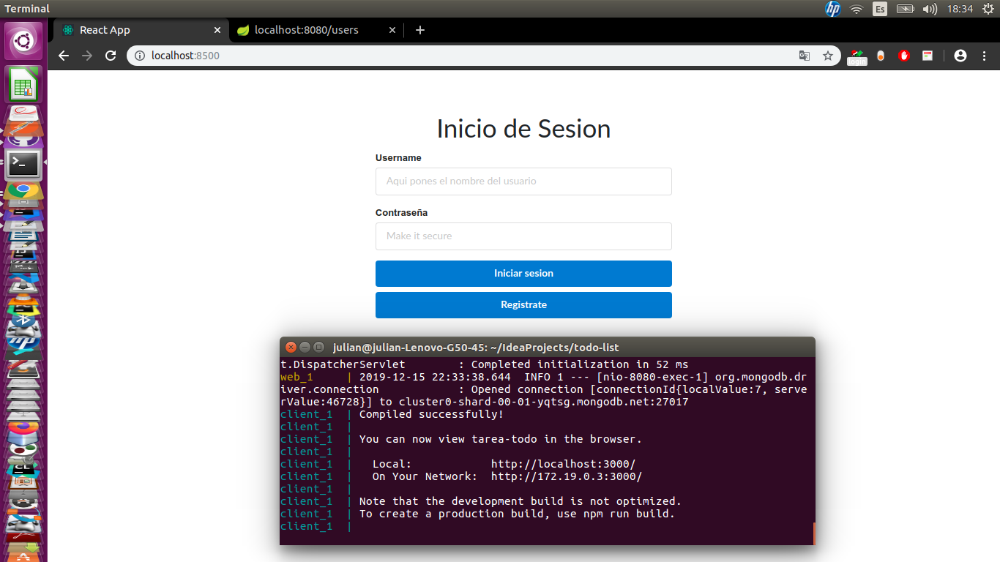

# todo-list
DOCKER TAREA DESARROLLO DEL SOFTWARE 202015

## Comenzando 🚀
Estas instrucciones te permitirán obtener una copia del proyecto en funcionamiento en tu máquina local para propósitos de desarrollo y pruebas.

### Pre-requisitos 📋
docker y docker-compose

Compose se puede instalar siguiendo las instrucciones en  https://docs.docker.com/compose/install/docker 
(Asegúrese de descargar la versión más nueva, ya que la versión de archivo de docker-compose es la 3)
### Configuración 🔧
* Diríjase a la carpeta principal del proyecto(donde se encuentran los directorios dockerfront, dockerserver y el docker-compose.yml) con el comando cd

Ejemplo:
```
julian@julian-Lenovo-G50-45:~/IdeaProjects$ cd todo-list
julian@julian-Lenovo-G50-45:~/IdeaProjects/todo-list$ ls
docker-compose.yml  dockerfront  dockerserver

```
* Ejecute el siguiente comando:
```
sudo docker-compose up
```
Con esto se crean los contenedores y se corren en un ambiente aislado. La primera vez que se ejecuta el comando puede tardarse 1-2 horas descargando todas las dependencias necesarias.
(Probado en varias zonas de caracas, parece depender mucho del internet)

El frontend estará en el puerto 8500 y el backend en el puerto 8080 

Al finalizar debería ver la página para loguearse:



Al ingresar carlos y 12345 como credenciales se accede a la página de todos del usuario carlos:


Los comandos para probar el backend están en: https://github.com/adnavarro/todo-list/tree/master/postman-collection

## Autores ✒️

_Menciona a todos aquellos que ayudaron a levantar el proyecto desde sus inicios_

* **Alfonso Navarro** - *Frontend*
* **Julián Uribe** - *Documentación, Backend*
